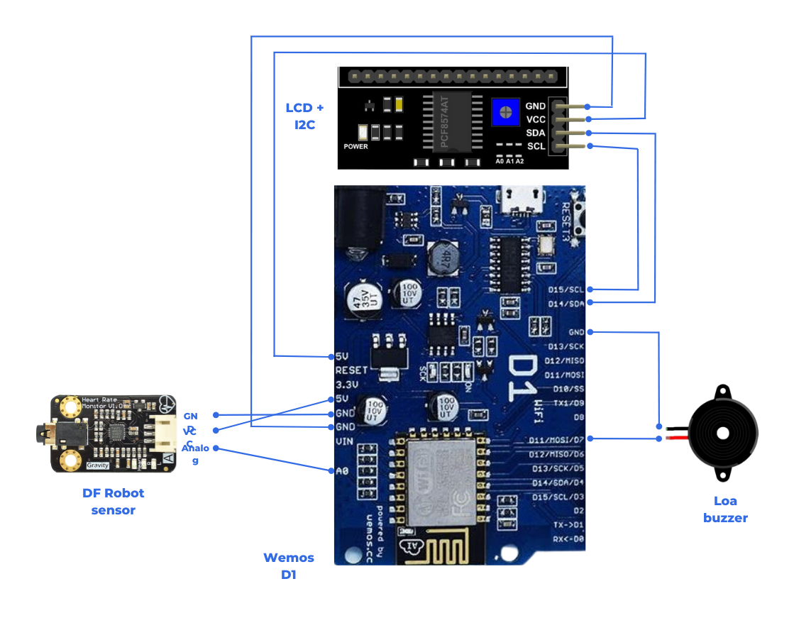

# **Thiết lập thiết bị phần cứng**

## **1. Lắp đặt các thiết bị phần cứng**

- Tiến hành lắp đặt sơ đồ phần cứng như hình dưới đây:

## **2. Board Install**

- Cài đặt Arduino IDE để lâp trình cho board Wemos D1
- Cài đặt các package cần thiết cho board Wemos D1
- Tham khảo hướng dẫn tại liên kết: [link](https://www.instructables.com/Arduino-WeMos-D1-WiFi-UNO-ESP-8266-IoT-IDE-Compati/)

## **3. Cài đặt các thư viện hỗ trợ sử dụng Firebase với Wemos D1**

- Tham khảo hướng dẫn tại liên kết: [link](https://randomnerdtutorials.com/esp8266-nodemcu-firebase-realtime-database/)

## **4. Cài đặt các thư viện hỗ trợ sử dụng LCD 16x2 với Wemos D1**

- Tham khảo hướng dẫn tại liên kết: [link](https://arduinokit.vn/giao-tiep-i2c-lcd-arduino/)

## **5. Nạp code**

- Sử dụng code trong file wemosd1.ino đính kèm và nạp vào board Wemos D1
- Thay đổi các thông số trong code để phù hợp với mạng wifi và database của bạn
- Nếu có các lỗi về driver, có thể chạy file CH341SER.EXE đính kèm để tiến hành gỡ driver cũ và cài đặt driver mới